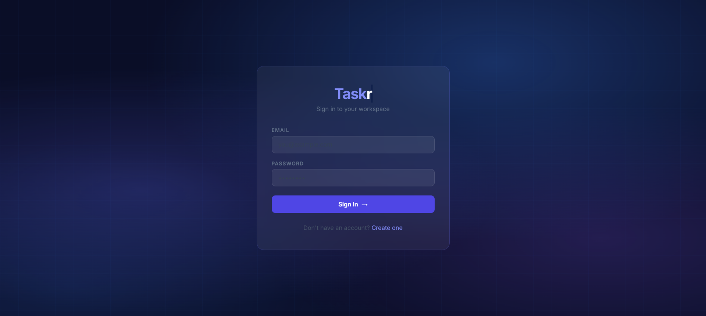
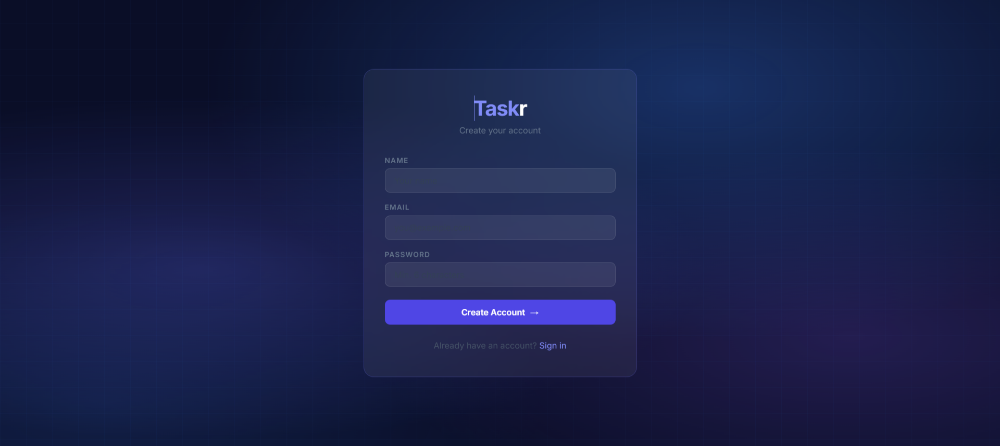
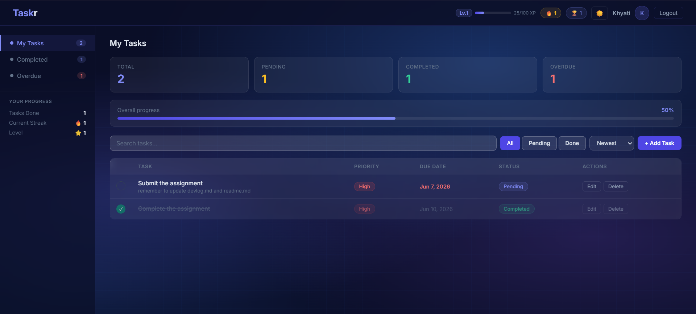
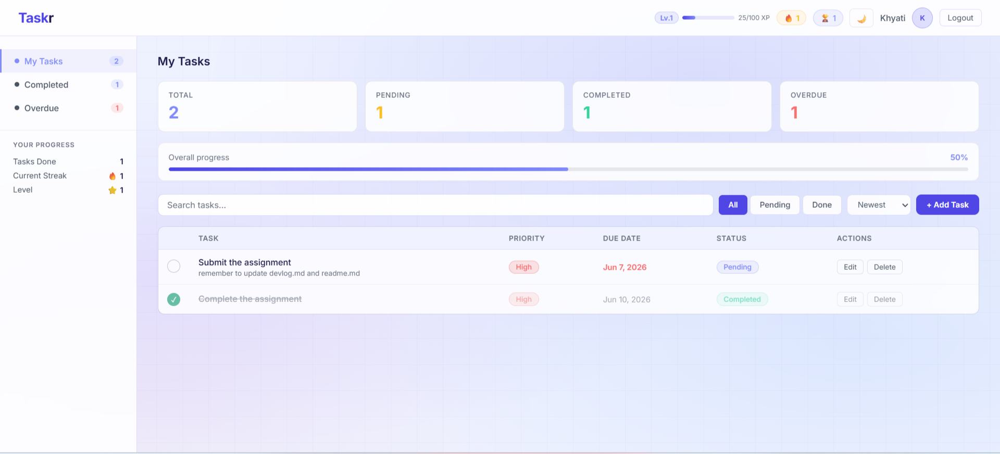
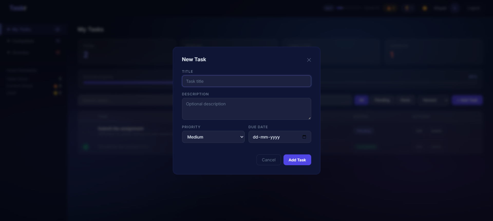
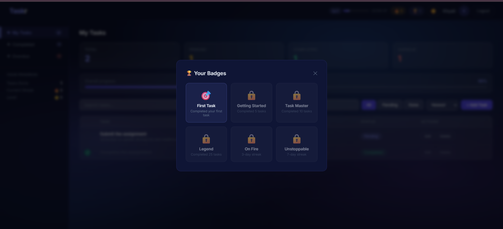

# Taskr — Task Manager

A full-stack productivity-focused Task Management application built with the MERN stack. Taskr helps users stay on top of their work with priority tracking, due date management, real-time progress monitoring, and a gamification system that rewards consistent performance.

This project was developed as part of the MERN Stack Internship Assignment for AvQuint Solutions Pvt Ltd.

---

## Overview

Taskr is designed for individuals who need a clean, distraction-free way to organize their tasks. Whether you're a student managing deadlines, a developer tracking project work, or a professional organizing daily tasks — Taskr keeps you focused and motivated.

## Screenshots

### Login


### Register


### Dashboard (Dark Mode)


### Dashboard (Light Mode)


### Add Task Modal


### Badges


### Who is it for?
- Students managing assignment deadlines
- Developers tracking project tasks
- Professionals organizing daily work

### Why Taskr?
- No clutter — just your tasks, clearly organized
- Priority + due date system keeps you focused on what matters
- Instant status toggle so you can mark progress in one click
- Gamification system rewards you for staying consistent
- Secure — your tasks are private and protected with JWT auth

---

## Features

### Authentication
- User Registration & Login
- JWT-based Authentication with 7-day token expiry
- Password Hashing using bcryptjs
- Protected Routes with middleware
- Persistent sessions via localStorage

### Task Management
- Create Task with title, description, priority and due date
- View all tasks in a structured table layout
- Edit task details via modal
- Delete task with confirmation prompt
- Toggle Task Status (Pending ↔ Completed) with one click
- Priority levels — High, Medium, Low with color-coded badges
- Due date tracking with overdue highlighting in red

### Dashboard
- Stats cards — Total, Pending, Completed, Overdue
- Overall progress bar (completion percentage)
- Sidebar navigation — My Tasks, Completed, Overdue with count badges
- Filter tabs — All, Pending, Done
- Sort by — Newest, Oldest, Priority, Due Date
- Real-time search by task title or description
- Dark / Light mode toggle — persists across sessions

### Gamification
- XP Points — earn XP on every task completed
  - High priority → 20 XP
  - Medium priority → 10 XP
  - Low priority → 5 XP
  - Early completion bonus → +5 XP
- Level System — level up every 100 XP, displayed in navbar with progress bar
- 6 Unlockable Badges
  - 🎯 First Task — complete your first task
  - 🚀 Getting Started — complete 5 tasks
  - ⭐ Task Master — complete 10 tasks
  - 👑 Legend — complete 25 tasks
  - 🔥 On Fire — achieve a 3-day streak
  - 💎 Unstoppable — achieve a 7-day streak
- Daily Streak tracking — build a streak by completing tasks every day
- Confetti animation on task completion
- Toast notifications for all actions
- Motivational messages on completion

### Security
- Passwords hashed using bcryptjs (never stored as plain text)
- JWT Token Authentication with expiry
- Protected API Routes via middleware
- User-specific Task Access — users cannot access others' tasks
- Input Validation on all endpoints
- Environment Variable Protection via dotenv

---

## Tech Stack

| Layer | Technology |
|---------|------------|
| Frontend | React 18, Vite, React Router v6, Axios |
| Backend | Node.js, Express.js |
| Database | MongoDB Atlas, Mongoose |
| Authentication | JWT, bcryptjs |
| Styling | CSS3, Inter & Syne Google Fonts |
| Environment Variables | dotenv |
| Development | nodemon, VS Code, Postman |

---

## Project Structure

```text
task-manager/
├── backend/
│   ├── config/
│   │   └── db.js
│   ├── middleware/
│   │   └── auth.js
│   ├── models/
│   │   ├── User.js
│   │   └── Task.js
│   ├── routes/
│   │   ├── auth.js
│   │   └── tasks.js
│   ├── .env          (not committed)
│   ├── .gitignore
│   ├── package.json
│   └── server.js
└── frontend/
    ├── src/
    │   ├── api/
    │   │   └── axios.js
    │   ├── components/
    │   │   └── ProtectedRoute.jsx
    │   ├── context/
    │   │   └── AuthContext.jsx
    │   ├── pages/
    │   │   ├── Login.jsx
    │   │   ├── Register.jsx
    │   │   ├── Dashboard.jsx
    │   │   ├── Auth.css
    │   │   └── Dashboard.css
    │   ├── App.jsx
    │   ├── main.jsx
    │   └── index.css
    ├── index.html
    └── package.json
```

---

## Installation

### Clone Repository

```bash
git clone https://github.com/khmkdh/task-manager.git
cd task-manager
```

### Backend Setup

```bash
cd backend
npm install
```

Create a `.env` file inside `backend/`:

```env
PORT=5000
MONGO_URI=your_mongodb_connection_string
JWT_SECRET=your_secret_key
```

Run backend:

```bash
npm run dev
```

Backend runs on `http://localhost:5000`

### Frontend Setup

Open a new terminal:

```bash
cd frontend
npm install
npm run dev
```

Frontend runs on `http://localhost:5173`

---

## API Endpoints

### Authentication

#### Register User

```http
POST /api/auth/register
```

Request:

```json
{
  "name": "Tulip",
  "email": "tulip@example.com",
  "password": "123456"
}
```

Response:

```json
{
  "_id": "user_id",
  "name": "Tulip",
  "email": "tulip@example.com",
  "xp": 0,
  "level": 1,
  "badges": [],
  "streak": 0,
  "token": "JWT_TOKEN"
}
```

#### Login User

```http
POST /api/auth/login
```

Request:

```json
{
  "email": "tulip@example.com",
  "password": "123456"
}
```

Response:

```json
{
  "_id": "user_id",
  "name": "Tulip",
  "email": "tulip@example.com",
  "xp": 100,
  "level": 2,
  "badges": ["first_task"],
  "streak": 3,
  "token": "JWT_TOKEN"
}
```

#### Get User Stats

```http
GET /api/auth/stats
```

#### Award XP

```http
POST /api/auth/award-xp
```

Request:

```json
{
  "xpAmount": 20,
  "taskCompletedEarly": true,
  "currentBadges": ["first_task"]
}
```

---

## Task Routes

All task routes require:

```http
Authorization: Bearer <token>
```

### Create Task

```http
POST /api/tasks
```

Request:

```json
{
  "title": "Complete Assignment",
  "description": "Finish MERN internship task",
  "priority": "high",
  "dueDate": "2026-06-10"
}
```

### Get All Tasks

```http
GET /api/tasks
```

Optional query parameters:

```http
/api/tasks?status=pending
/api/tasks?status=completed
/api/tasks?search=keyword
```

### Get Single Task

```http
GET /api/tasks/:id
```

### Update Task

```http
PUT /api/tasks/:id
```

Request:

```json
{
  "title": "Updated Task",
  "description": "Updated description",
  "status": "completed",
  "priority": "medium",
  "dueDate": "2026-06-15"
}
```

### Toggle Status

```http
PATCH /api/tasks/:id/toggle
```

### Delete Task

```http
DELETE /api/tasks/:id
```

---

## Security Features

- Passwords hashed using bcryptjs (never stored as plain text)
- JWT Token Authentication with 7-day expiry
- Protected API Routes via middleware
- User-specific Task Access — users cannot access others' tasks
- Input Validation on all endpoints
- Environment Variable Protection via dotenv

---

## Future Enhancements

- Task Categories and Tags
- Pagination for large task lists
- Email Notifications for overdue tasks
- Leaderboard for team productivity
- Deployment to Vercel + Railway

---

## Developer

**Khyati**

GitHub: https://github.com/khmkdh

---

## License

This project is developed for educational and internship evaluation purposes.